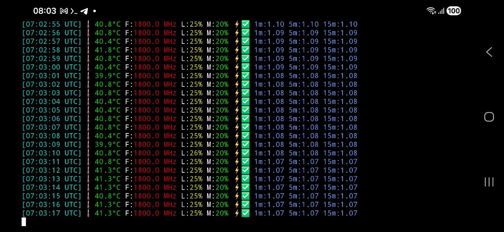

# 🧩 Raspberry Pi ARM64 System Monitor — Pure Assembly (AArch64)

Un moniteur système complet, écrit **entièrement en assembleur ARMv8‑A (AArch64)**, sans libc, sans dépendances, utilisant uniquement les **syscalls Linux**.  
Ce projet a été conçu **dans un but didactique**, pour explorer l’assembleur ARM64 sur Raspberry Pi 4B — et il a évolué en un véritable tableau de bord système en temps réel.
Depuis la version 2.4, le moniteur intègre une coloration dynamique de la fréquence CPU basée sur une table ANSI 256, ainsi qu’une refactorisation majeure améliorant la lisibilité et la stabilité du code.

DRAFT : Cette documentation doit être mise à jour afin de refléter les améliorations présentes dans la version actuelle (v2.7).

---

# ✨ Fonctionnalités principales

Le programme affiche en continu :

## 🕒 Horodatage UTC
- Lecture via `clock_gettime(CLOCK_REALTIME)`
- Conversion HH:MM:SS sans libc
- Affichage en cyan

## 🌡️ Température CPU
- Lecture directe du SoC : `/sys/class/thermal/thermal_zone0/temp`
- Conversion millidegrés → degrés + dixième
- Couleur dynamique :
  - vert < 50°C  
  - jaune < 65°C  
  - orange < 80°C  
  - rouge ≥ 80°C  
- Emoji thermomètre (optionnel)

## 🚀 Fréquence CPU
- Lecture : `/sys/devices/system/cpu/cpu0/cpufreq/scaling_cur_freq`
- Conversion kHz → MHz (avec décimale)
- Coloration dynamique via une table ANSI 256 (nouveau en v2.4)  
  Sélection automatique via la routine select_cpu_color

## ⚡ État électrique (under‑voltage)
- Lecture : `/sys/devices/platform/soc/soc:firmware/get_throttled`
- Parsing hexadécimal → entier
- Bit 0 = sous‑tension
- Affichage :
  - `⚡️❌` en rouge (under‑voltage)
  - `⚡️✅` en vert (OK)

## 🧮 Charge CPU (instantanée)
- Lecture : `/proc/stat`
- Calcul du pourcentage CPU utilisé depuis l’intervalle précédent
- Couleur dynamique :
  - vert < 25%
  - jaune < 50%
  - orange < 75%
  - rouge ≥ 75%

## 📊 Load averages (1m, 5m, 15m)
- Lecture : `/proc/loadavg`
- Extraction des trois valeurs
- Affichage coloré

## 🧠 RAM utilisée (%)
- Lecture : `/proc/meminfo`
- Parsing de `MemTotal` et `MemAvailable`
- Calcul du pourcentage utilisé
- Couleur dynamique :
  - vert < 50%
  - jaune < 80%
  - rouge ≥ 80%

---

# 🎥 Vidéos de présentation

Deux vidéos illustrent l’évolution du projet, depuis la version initiale (0.0) jusqu’à la version avancée (1.9).  
Elles montrent la progression pédagogique du moniteur système en assembleur ARM64 sur Raspberry Pi 4B.

---

## 🔹 Version 0.0 — Première ébauche (lecture simple de la température)

[](https://youtu.be/9T2jM_kBt7g)

➡️ https://youtu.be/9T2jM_kBt7g

---

## 🔹 Version 1.9 — Moniteur système complet

[](https://youtu.be/Y2lfMdMY5QY)

➡️ https://youtu.be/Y2lfMdMY5QY

---

## 🔹 Version 2.4 — Coloration CPU refactorisée (2026‑03‑22)

---

## 🔹 Version 2.7 — Optimisations diverses et migration de as vers gcc (2026‑03‑25)

---

# 📸 Captures d’écran

Voici un aperçu du moniteur système ARM64 en action, exécuté sur un Raspberry Pi 4B via un terminal Termux sur smartphone (connexion SSH).

<p align="center">
  
</p>

<p align="center"><em>Affichage en temps réel : température, fréquence CPU, charge, RAM, load average et état électrique.</em></p>

---

# 🎧 Fichiers audio explicatifs

Les fichiers audio (versions mono) sont disponibles dans : `docs/audio`

- `audio_RPi4b_AArch64_Assembly_System_Monitor_v0.0_mono.m4a`  
- `audio_RPi4b_AArch64_Assembly_System_Monitor_v1.9_mono.m4a`

Ils commentent la démarche pédagogique et l’évolution du projet.

---

# 🕰️ Historique des versions

## **Version 2.2 — Refactoring majeur (2026‑03‑19)**
- Factorisation des routines (`read_file`, `parse_uint`, `parse_hex`, `uint_to_str`, `copy_str`)
- Code plus lisible, modulaire, robuste
- Calcul CPU amélioré
- Parsing RAM amélioré
- Gestion des couleurs optimisée
- Nettoyage du buffer plus efficace
- Registres dédiés pour les valeurs persistantes
- Structure générale clarifiée

## **Version 1.9**
- Température CPU (couleurs dynamiques + emoji)  
- Fréquence CPU (MHz + dixième)  
- Charge CPU instantanée (%)  
- RAM utilisée (%)  
- Load averages  
- Under‑voltage  
- Horodatage UTC  
- Couleurs ANSI  
- Rafraîchissement 1 Hz  
- Parsing complet de `/proc` et `/sys`  

## **Version 0.0**
- Lecture de la température CPU  
- Conversion millidegrés → degrés  
- Affichage minimaliste  
- Syscalls : openat, read, write, close  

---

# 🧱 Architecture du programme

Le programme suit une boucle simple :

1. Lire température  
2. Lire throttling  
3. Lire fréquence CPU  
4. Lire loadavg  
5. Lire `/proc/stat` et calculer CPU%  
6. Lire `/proc/meminfo` et calculer RAM%  
7. Lire l’heure UTC  
8. Formater et colorer chaque section  
9. Afficher la ligne complète  
10. Pause 1 seconde  

Aucune allocation dynamique.  
Aucun appel à libc.  
Uniquement des **syscalls Linux ARM64**.

---

# 🔧 Syscalls utilisés

| Fonction | Syscall | Description |
|---------|---------|-------------|
| `openat` | 56 | Ouvrir un fichier dans `/sys` ou `/proc` |
| `read` | 63 | Lire les données |
| `close` | 57 | Fermer le fichier |
| `write` | 64 | Affichage |
| `clock_gettime` | 113 | Heure UTC |
| `nanosleep` | 101 | Pause |
| `exit` | 93 | Quitter |

---

# 🛠️ Compilation

Assembler et lier statiquement :

```bash
as -o monitor_temp.o monitor_temp.s
gcc -nostdlib -static -o monitor-temp-ASM monitor_temp.o
strip monitor-temp-ASM
```

## ▶️ Exécution

```bash
./monitor-temp-ASM
```

## Exemple de sortie

```bash
[18:24:51 UTC] 🌡 44.3°C F:1800.0 MHz L:77%  M:20%  ⚡️✅  1m:3.51 5m:1.58 15m:1.01
```

## 🎯 Objectif pédagogique

Ce projet a été conçu pour :

- me faire découvrir l’assembleur ARM64  
- comprendre les syscalls Linux  
- manipuler `/proc` et `/sys`  
- apprendre les conversions numériques sans libc  
- structurer un programme assembleur complexe  
- progresser version après version  
- documenter l’évolution avec vidéos et audios  

Il n’a aucune prétention de performance ou de production — seulement le plaisir d’apprendre et d’expérimenter.

---
